# One Stop Shop!

Welcome to One Stop Shop! The online high street shopping outlet. 

This multi-functional web application has been made with the use of Django Full-Stack Frameworks. 
Its high powered libraries and compatability with databases allow for strong and scalable web applications. 

The site allows users to browse items throughout the store, add items to and edit the contents of their shopping cart, 
purchase items through [Stripe](https://stripe.com) and view their order history on their profile page!

Admin users are also able to add or remove items from the store while also having the ability to edit current products! 
Its also really easy for all user to view whats been happening recently with the new buliten board, superusers also have the 
functionality to add, remove or edit entries here too.

Finally, we understand that feedback and communication are important so we have our own contact page for users to get in touch!

---

While this site is not real, the best efforts have gone in to making sure that it is as functional as possible.

The live link for the [app](https://coolusername244-one-stop-shop.herokuapp.com/)

The link for the [GitHub Repo](https://github.com/coolusername244/MS4)

---
## UX

One Stop Shop was designed to have an easy, natural and familiar. In this section you will find the wireframes and User Stories. I have also included "A Typical User Journey" describing the path to build off of and relate to user stories.


### Wireframes
All of the wireframes for this project are included below, click the arrow to reveal

 - <details open>
    <summary>Base HTML</summary>
    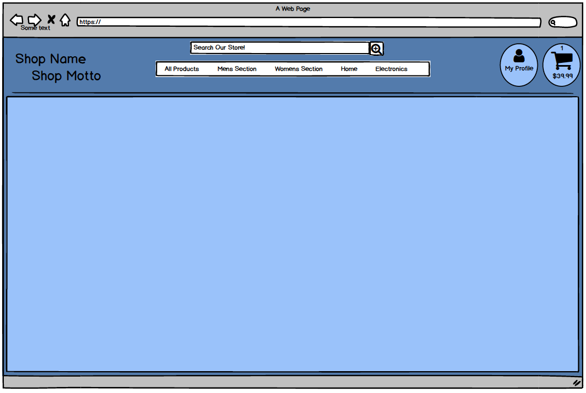
    </details>

 - <details open>
    <summary>Home Page</summary>
    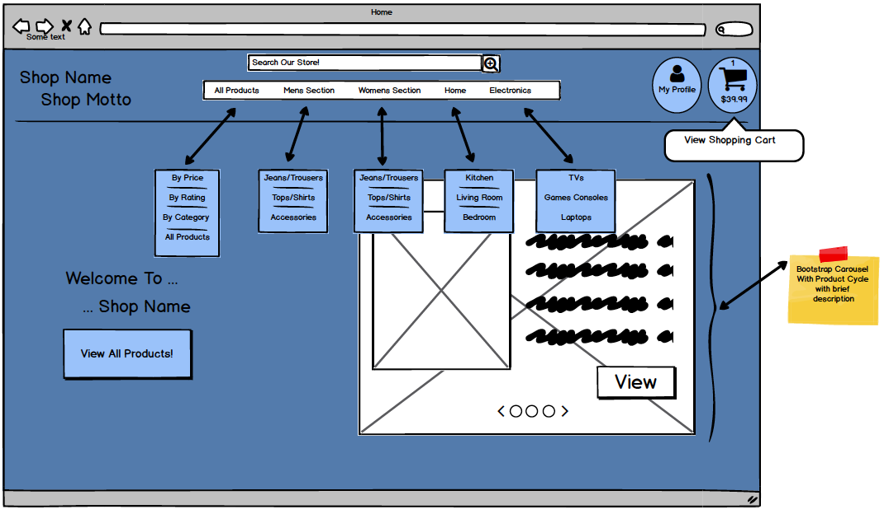
    </details>

 - <details open>
    <summary>All Products</summary>
    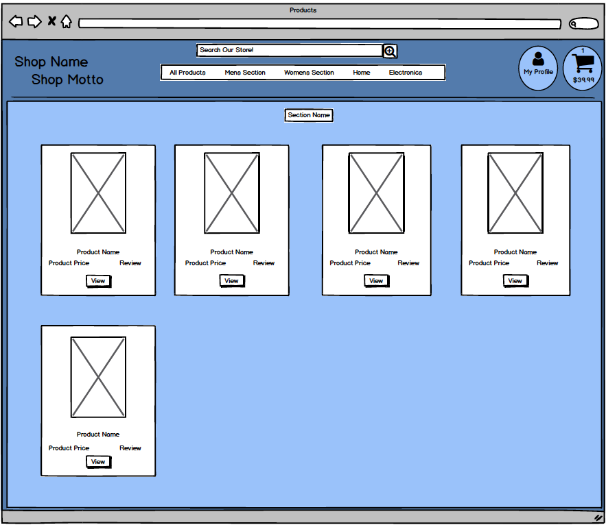
    </details>

 - <details open>
    <summary>Single Product</summary>
    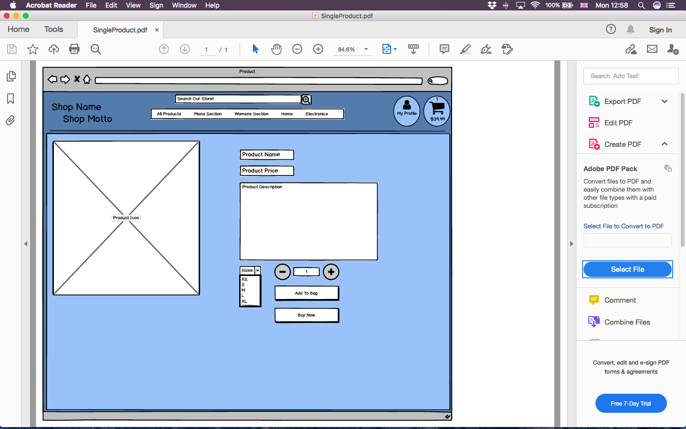
    </details>

 - <details open>
    <summary>Shopping Bag</summary>
    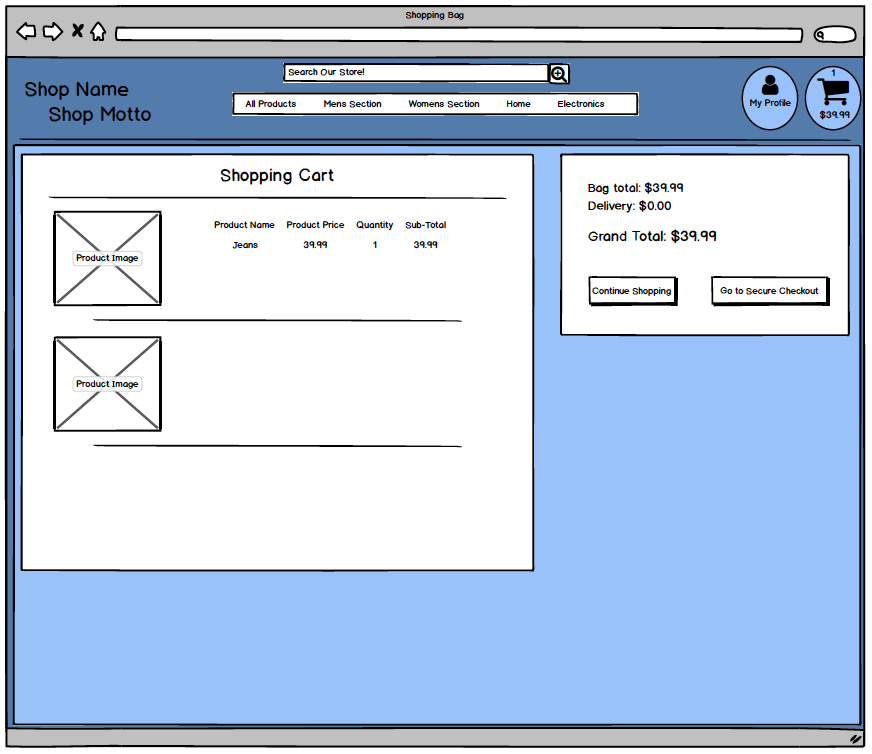
    </details>

 - <details open>
    <summary>Login</summary>
    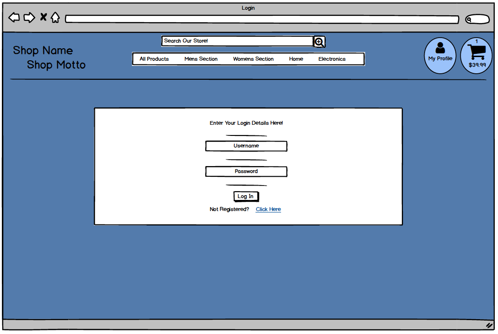
    </details>

 - <details open>
    <summary>Register</summary>
    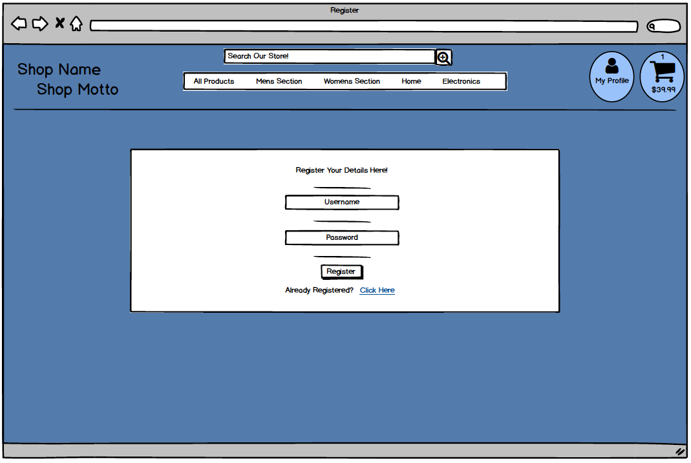
    </details>

---


### User Stories


- ### Viewing and Navigation

| USER STORY ID | AS A/AN... | I WANT TO BE ABLE TO... | SO THAT I CAN... | AS A DEVELOPER, I HAVE...
| - | - | - | - | - |
| 1 | USER | View all products that the store has to offer | Quickly see if there are any products id like to purchase | As soon as the user lands on the home page, they are greeted with some text and a button that will take them to the list of allavailable products
| 2 | USER | View individual products and their details | See all info regarding a specific item | When the user clicks on the image of a product they like the looks of, they will be redirected to the single-product-detail page
| 3 | USER | Easily see the total of all products in the basket for purchase | To avoid spending too much! | Each time the user updates the bag items, the price is automatically calculated and displayed to the user as well as their shopping bag item total

- ### Registration and Accounts

| USER STORY ID | AS A/AN... | I WANT TO BE ABLE TO... | SO THAT I CAN... | AS A DEVELOPER, I HAVE...
| - | - | - | - | - |
| 4 | NEW USER | Easily be able to register for an account | View my account details and info | Added a button labelled 'Account', when the user clicks, they will be shown 2 options, Register or Login. Clicking Register will take the user to the profile registration form.
| 5 | RETURNING USER | Easily be able to log in and out of my account | Access my personalised account | The 'Account' button will allow users to also log in and out.
| 6 | RETURNING USER | Easily recover my password if I have forgottten it | Regain access to my account | Enabled (through Django AllAuth) for the user to click the 'Forgot Password' link on the Sign In page. Clicking this will mean that the user will have to enter their email address connected to their profile and will recieve an email with instructions to reset the password
| 7 | NEW USER | Receive an email confirmation after successful registration | To ensure that the process has been successful | Once the user has filled out the registration form correctly, the user will be sent a verification email with a link to follow to activate the account. This has been achieved with Django AllAuth.
| 8 | RETURNING USER | Have a personalised account profile | Centralise all of my order history, delivery info and card info | Customer order histories are located on their profile page. They are shown a smaller version of this and are able to click the link for a full view of a particular order.

- ### Sorting and Searching

| USER STORY ID | AS A/AN... | I WANT TO BE ABLE TO... | SO THAT I CAN... | AS A DEVELOPER, I HAVE...
| - | - | - | - | - |
| 9 | USER | Sort the list of products | By highest rated, price etc | Installed a filter located at the top of the products view. Users are able to organise by - Price, Category, Rating or Name
| 10 | USER | Easily filter products by category | So I can find the best products in the category I wish to view | Made it so the category of each item is visible and clickable. Users can click on the category name and the products will be filtered to that specific one.
| 11 | USER | Search for a product by name or description | So I can view a product I know the name of | Included a search bar that is located at the top of each page. Once users have entered a search term, the function will search all of the product info for the users query. The user is also shown the number of results and their search term, just incase they have made a typo, its easily seen. 
| 12 | USER | Be presented with the results of what I have searched for | So I can see if the product I wish to purchase is available | All of the results that have been given from the search are listed on the page, the same way they are on the products page.

- ### Purchasing and Checkout

| USER STORY ID | AS A/AN... | I WANT TO BE ABLE TO... | SO THAT I CAN... | AS A DEVELOPER, I HAVE...
| - | - | - | - | - |
| 13 | USER | Easily select the quantity and/or size of item | To ensure that I know what size/quantity I am buying | When looking at individual items, users have the option to chose how many units they want (1-90) and if the item has a size i.e. clothing, they can pick from a dropdown menu. They are also able to change the unit quantity while reviewing the bag before checkout. 
| 14 | USER | View items that are in my bag | So I can see if I am missing anything | Each time an item is added they will be shown a small window with shopping bag contents and also users are able to click the shopping cart link to review products before payment and adjust if needed. 
| 15 | USER | Adjust the item quantity in the bag | In case I feel the amount isnt right | As above
| 16 | USER | Recieve an email confirming order and successful paymenet | To ensure that everything has worked and I now sit back until delivery | Ensured that users recieve an email order confirmation once [Stripe](https://stripe.com) has recieved payment. 
| 17 | USER | Have an option to save delivery info to profile | To make future checkouts faster | On the users profile page, they will be presented with a form for their delivery information to be filled out. Once the user updates and clicks save, they can go to the checkout an their info will be prefilled.
| 18 | USER | view order confirmation after checkout | To ensure that everything has worked and I now sit back until delivery | Upon successful payment, the user will be shown a confirmation of their order as well as seeing a mesage displayed re email confirmation. 
| 19 | USER | Feel like the store has a robust checkout process | Feel safe spending money online | Using [Stripes](https://stripe.com) elements, the user will be given a secure feeling as it is filled out and reacting as needed

- ### Admin 

| USER STORY ID | AS A/AN... | I WANT TO BE ABLE TO... | SO THAT I CAN... | AS A DEVELOPER, I HAVE...
| - | - | - | - | - |
| 20 | Administrator | Add a product | Keep the store up to date | Installed a button which is located within the account dropdown menu - The button will only be visible to superuser
| 21 | Administrator | Edit a product | Keep the store up to date | Added an edit button next to items that is only visible to superusers
| 22 | Administrator | Delete a product | Keep the store up to date | Added a delete button next to items that is only visible to superusers
| 23 | Administrator | Add News Article | Keep users up to date with the latest news | Installed blog style news post to the site where only superusers have the authority to update, edit and delete. All users can view
| 24 | User and Admin | Contact the admin | Send praise or complain | I have added a contact form that once completed will notify the user that an email has been sent and will send an email to the admin (me)

- ## A typical user journey 

  - User lands on to the home page and clicks 'SHOP NOW'
  
  - User is shown all products and clicks on and likes the look of an item in the  'Womens Jeans & Trousers' category

  - User decides to look at only 'Womens Jeans & Trousers' by clicking the grey link under the price

  - User selects an item to buy, inspects the details, selects quantity and size of item

  - User is sure they would like to buy so they click 'ADD TO BAG'

  - User is show a success message containing their order and a button that will guide them towards the checkout page

  - User will have an oppertunity to review their order, change the quantity of items or remove them completely

    - Should the user remove all items from the bag, they are informed that the bag is empty and have a button back to the products page

  - Once the user is satisfied with their order they will click the 'CONTINUE TO SECURE CHECKOUT" button

  - The user will then proceed to fill out the required delivery information and at the bottom of the form, they are prompted that they will be able to save the info and create order histories by creating a profile

  - User will click to register a profile and fill out the form for verification

  - Once form is satisfied and submitted, user will recieve an email requesting to confirm their email

  - Once following the link, they are redirected to the confirm email page where they click a button to verify

  - Then required to log in

  - Then redirect to the checkout

  - Fill out the form with their details and have the checkbox ticked (this is done automatically)

  - Upon order confirmation, they are taken to the success page and will also recieve an email confirming their order

  - User can now go to their profile page and they will see their delivery info and order history

  - Once order has been placed, customer is likely to browse the rest of the site, thus seeing the news and contact

  - User clicks on the news button to see all of the latest information 

  - User then clicks on contact, sending the admin a nice thank you email

---

## Features
### Existing Features

Home Page and Base HTML - ' / '
-

- Search Bar 
  - The search bar allows users to search the site for desired products
  - If the user searches for something that is in the store such as jeans, they will be presented with all of the results and how many
  - if search bar is empty when clicked, user will be shown all products and also shown a message that the box was empty

- 'Shop Now' landing screen button
  - Designed to get the user shopping as quickly as possible
  - Once clicked, the user will be shown all the products in the store 

- Navabr
  - The navbar on desktop spans the top of the page and is home to all of the category and section buttons
  - Contains shopping cart button which adjusts the price and item quantity each time bag is updated
  - Contains Account button which, if you are not authenticated, will only have the options to login or register, once the user is logged in then they will change to 'My Profile' and 'Logout'
  - Superusers will also have the button to add a prroduct to the store
  - While not logged in, button only reads 'Account', when user is logged in, this changes to 'My Account'
  - Categories are hidden on smaller devices and are shown by a burger icon in the top left of screen

Products - ' /products '
-

 - Category Sorter 
   - This will allow users to sort the sort the products from highest to lowest in terms of:
     - Price (low to high)
     - Rating (low to high)
     - Name (A-Z)
     - Category (A-Z)
    - Once the category has been selected, javascript will refresh the page having adjusted for the conditions

- Products 
  - The user is shown all of the products in their respective category and they are all within their own package courtesy of the for loop!
  - The image is the largest part of the Product section, and once clicked will take you to the details for that product
  - Superusers are shown an edit and delete button
  - all users are shown the rating and category of the products
  - clicking on the category will show you all products that share the same category

- Single Product Detail 
  - Users are presented with a description of the item they are looking at
  - Users are able to select the quantity by pressing '+' or '-' buttons either side of the number or they can type the amount
  - If the item has a size, they are also able to select the size through a dropdown menu


- Back to Top Button 
  - As the page gets rather long, I have added a button to take the user back to the top of the page

News - ' /news ' + ' /news/add_news ' 
-

- News Blog
  - News page for users of the site to keep up to date with whats happening
  - When user is not a superuser, the News section of the navbar is just a button whereas for a superuser it is a dropdown and has the option to add an entry
  - Superusers have a form to fill and if they have no image to upload, a default image will be present instead
  - News is presented in blog post form with most recent posts at the top of the page 
  - Time of publish and author is also visable to all users

Contact - ' /contact ' 
-

- Contact Form 
  - Should the user wish to get in contact with the management for any reason, they are able to do so
  - Once the form has been submitted, the user will see a message appear on their screen explaining that it was successful and the emil was sent
  - As the store is not real, the email it gets sent to is mine

Profile - ' /profile ' 
-

- Delivery information
  - When the user first makes a profile, the form will be empty
  - The user can fill oout their profile info here and click update and it will be remembered and recalled during the checkout process
  - The user can also populate this field by filling it out within the checkuot app and having the 'remember' box checked

- Order History 
  - Users are able to view their order history here
  - When users click on the numbers that are highlighted blue they will be taken to the order confirmation for their previous order (Note - the blue numbers are the first few numbers of the order number)

Add a Product - ' /products/add ' 
-

- Add Product Form 
  - Only accessable to superusers
  - This form will add a new product to the store for all to see
  - If the form is submitted with no image, a default image will apply instead 

Shopping Cart - ' /bag ' 
- 

- Shopping Cart 
  - User is able to review their order 
  - The user is able to adjust the quantity of an item by pressing the '+' or '-' button and then clicking'Update qty'
  - The user is also able to remove the item from the bag entirely by clicking the small grey x located on right of the table
  - User is told how many items there are in total in the bag. With the use of if statements, the shopping bag will say item or items depending on value
  - User is given the button "Continue to checkout' buttton to click once they have reviewed their order 

Checkout - ' /checkout ' 
- 

- Delivery Form
  - The user has a form to fill here for their delivery info
  - The form can be filled out by updating the delivery details in the profile app
  - After ensuring that the checkbox is checked to save your info, when you submit the form, the data will also be saved to the users profile page

- Stripe 
  - Stripe has been used here to handle payments from users
  - Stripe can handle user authentication and handles responses which can be presented to the user in a UI friendly manner


- Order Summary 
  - To ensure that the customer really is sure on what they are buying, there is an order summary containing everything the user will be purchasing

---
## Testing

- Test 1 - User can add product to shopping cart - Test Passed 
  - Step 1 - click shop now
  - Step 2 - click any product
  - Step 3 - click add to bag
  - Step 4 - see success message
  - Step 5 - click shopping cart icon 
  - Step 6 - review item is in shopping bag


- Test 2 - User can remove product from cart - Test Passed 
  - Step 1 - click add to bag on a product
  - Step 2 - click shopping cart icon 
  - Step 3 - click x icon on product you wish to delete
  - Step 4 - see info message - "item removed from bag"

- Test 3 - Signing up for profile - Test Passed 
  - Step 1 - click the account button
  - Step 2 - fill in the required forms (The forms will not submit without the required forms filled correctly. Relevent error messages are displayed thanks for allauth)
  - Step 3 - go to your email 
  - Step 4 - open verification email
  - Step 5 - follow link
  - Step 6 - press confirm
  - Step 7 - sign in with your chosen username and password


- Test 4 - Adding delivery info from checkout - Test Passed 
  - Step 1 - from the shopping bag, click 'continue to secure checkout'
  - Step 2 - add all details to form
  - Step 3 - make sure that checkbox for saving info is checked (should happen automatically)
  - Step 4 - using stripes test checkout number, proceed to checkout as planned
  - Step 5 - once order is complete, navigate to My Profile
  - Step 6 - Observe that delivery info is populated


- Test 5 - Editing delivery info in profile app - Test Passed 
  - Step 1 - While in My Profile, edit the delivery info
  - Step 2 - click update information
  - Step 3 - see success message
  - Step 4 - add a product to the bag and proceed to the checkout and observe address change


- Test 6 - Review previous orders - Test Passed 
  - Step 1 - make sure you are logged in
  - Step 2 - make an order
  - Step 3 - click My Profile
  - Step 4 - On the right hand side will be a list of previous orders
  - Step 5 - click the order number
  - Step 6 - review previous order


- Test 7 - Signing in to profile - Test Passed 
  - Step 1 - ensure you are logged out
  - Step 2 - click Account button
  - Step 3 - click log in 
  - Step 4 - enter credentials
  - Step 5 - click sign in
  - Step 6 - be redirected to home page and see success message


- Test 8 - Signing out to profile - Test Passed 
  - Step 1 - Ensure you are logged in
  - Step 2 - click Account button
  - Step 3 - click logout
  - Step 4 - click sign out


- Test 9 - Getting a new password - Test Passed 
  - Step 1 - While you are logged out, click Login
  - Step 2 - click Forgot Password
  - Step 3 - enter email address
  - Step 4 - click reset my password
  - Step 5 - check your email
  - Step 6 - open email titled 'Password Reset Email'
  - Step 7 - open the link
  - Step 8 - enter new password
  - Step 9 - click change password
  - Step 10- Observe screen which says 'Your password has now been changed'

- Test 10 - Adding a news article - Test Passed 
  - Step 1 - ensure you are logged in as a superuser
  - Step 2 - click News in the navbar
  - Step 3 - click Add Entry
  - Step 4 - fill out required fields
  - Step 5 - click Add News Article
  - Step 6 - observe redirection to news page and new entry is at top
  - Step 7 - observe info message stating that news has been added successfully 


- Test 11 - Deleting a news article - Test Passed 
  - Step 1 - ensure you are logged in as a superuser
  - Step 2 - click News in the navbar
  - Step 3 - click View All
  - Step 4 - click delete on the entry you wish to discard
  - Step 5 - observe that news article has been deleted
  - Step 6 - observe info message stating that news has been deleted successfully


- Test 12 - Editing a news article - Test Passed 
  - Step 1 - ensure you are logged in as a superuser
  - Step 2 - click News in the navbar
  - Step 3 - click View All
  - Step 4 - click edit on the entry you wish to change
  - Step 5 - you will see the same form as adding but with the fields populated with the current contents
  - Step 6 - make changes and click edit article
  - Step 7 - be redirected to news page and see that blog has been changed and info message advising so


- Test 13 - Sending email to superuser - Test Passed 
  - Step 1 - click Contact Us on the navbar
  - Step 2 - fill out required fields
  - Step 3 - click send
  - Step 4 - observe redirection to home page and message confirming tha temail was sent


- Test 14 - Adding a product to the store - Test Passed 
  - Step 1 - ensure you are logged in as a superuser
  - Step 2 - click My Account
  - Step 3 - click Add A Product 
  - Step 4 - fill out required fields
  - Step 5 - click add product button
  - Step 6 - observe redirect to new product
    - Step 7 - if product has sizes, show drop down
    - Step 8 - if product has no image, show default image
    - Step 9 - if product has no rating, show 'no rating'


- Test 15 - Editing a product within the store - Test Passed 
  - Step 1 - ensure you are logged in as a superuser
  - Step 2 - you will be able to see the edit button on both the view for all products and the single product view
  - Step 3 - once clicked, you will be shown the form with all the data prefilled out
  - Step 4 - once you have made your changes click 'Update this Product'
  - Step 5 - observe redirect to product detail page and see data edited
  - Step 6 - observe info message saying update successful

- Test 16 - Deleting a product from the store - Test Passed 
  - Step 1 - ensure you are logged in as superuser
  - Step 2 - you will be able to see the delete button on both the view for all products and the single product view
  - Step 3 - when the button has been clicked, you will be redirected to the products page and see a success message

HTML Validator
-

- Html Passed with only one error and that is that there is a duplicate ID, this is by design as there is a for loop that checks to see if user is superuser
  <details open>
    <summary>Html Validator Image</summary>
    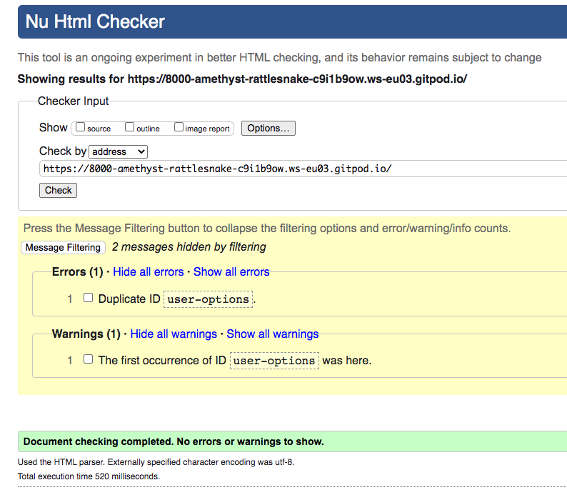
    </details>

CSS Validator
-

- CSS has passed with only 1 warning, explaining that it was just the file that was checked.
  <details open>
    <summary>CSS Validator Image</summary>
    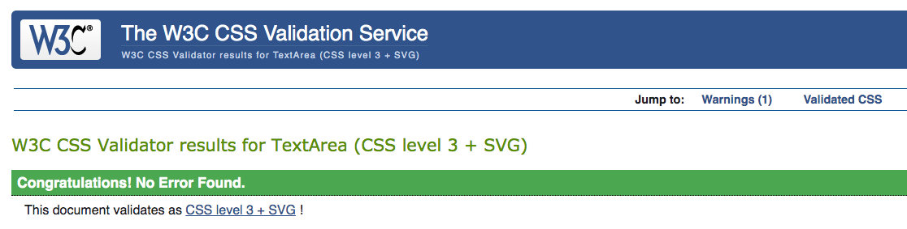
    </details>
  <details open>
    <summary>CSS Validator Warning</summary>
    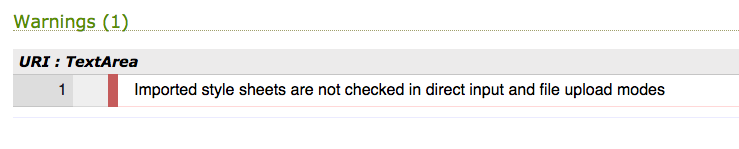
    </details>

Flake8 Validator
-

- Flake8 errors have minimised as much as possible, however, errors remaining are mostly in migration files and other files which have not been edited by myself.
- Null = True will be remaining the same as to reduce any errors in Django

- Images are below from git pod
  <details open>
    <summary>Flake8 Image</summary>
    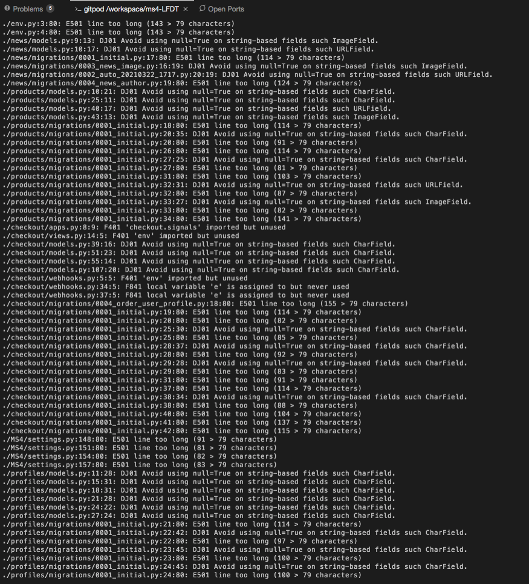
    </details>
  <details open>
    <summary>Flake8 Image</summary>
    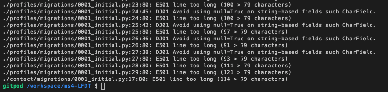
    </details>
  <details open>
    <summary>Django Docs</summary>
    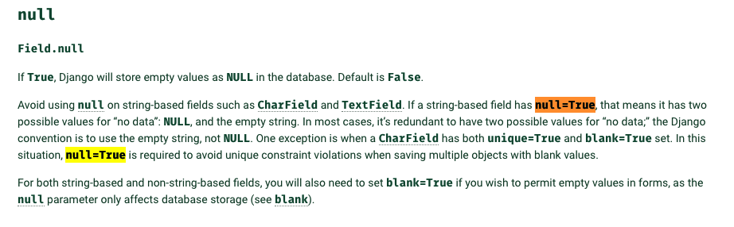
    <p>https://docs.djangoproject.com/en/3.1/ref/models/fields/</p>
    </details>

Lighthouse
-

- <details open>
    <summary>Lighthouse Validator Image</summary>
    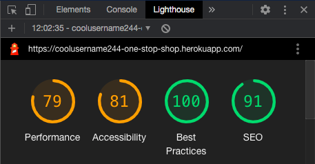
    </details>
---
# Technologies Used 

- [HTML](https://en.wikipedia.org/wiki/HTML)

- [CSS](https://en.wikipedia.org/wiki/CSS)

- [JavaScript](https://en.wikipedia.org/wiki/JavaScript)

- [jQuery](https://en.wikipedia.org/wiki/JQuery)

- [Python](https://en.wikipedia.org/wiki/Python_(programming_language))

- [Bootstrap](https://getbootstrap.com/docs/4.4/getting-started/introduction/) - Used for its extensive libraries for responsive designs. From bootstrap I have utalised the Navbar, Forms, Dropdown menus and toasts

- [Font Awesome](https://fontawesome.com/) - Used to add icons to the site

- [Google Fonts](https://fonts.google.com/) - Used to add fonts to the site

- [Django](https://www.djangoproject.com/) - Used to build the site itself using its full-stack frameworks

- [Stripe](https://stripe.com/) - Used to handle card payments from users

- [GitHub](https://github.com/) - Used to host all code 

- [GitPod](https://www.gitpod.io/) - Used as my prefered IDE 

- [Heroku](https://en.wikipedia.org/wiki/Heroku) - Used as a hosting platform in this project 

- [Balsamiq](https://balsamiq.com/) - Used to complete the Wireframes 

- [AWS S3](https://aws.amazon.com/s3/) For hosting images for site

- [Boto3](https://boto3.amazonaws.com/v1/documentation/api/latest/index.html) - Used as part of migrating media to AWS 

- [Django AllAuth](https://django-allauth.readthedocs.io/en/latest/) - All Auth has been implimented to allow full use of the Account functionality (creating account, resetting emails etc)

- [Django Countries](https://pypi.org/project/django-countries/) - To make the country field more visually appealing

- [Django Crispy Forms](https://django-crispy-forms.readthedocs.io/en/latest/) - To style forms elements

- [Django Storages](https://django-storages.readthedocs.io/en/latest/) - Used as part of migrating media to AWS 

- [Gunicorn](https://gunicorn.org/)

- [Pillow](https://pillow.readthedocs.io/en/stable/) - Allowing images to be shown on site

- [Psycopg2-binary](https://pypi.org/project/psycopg2-binary/) - Used for its prosgres adaption features

- [SQlite](https://www.sqlite.org/index.html) - Used as development database 
---
## Deployment

###  Cloning the project

 - Step 1 - Log in to your github account
 - Step 2 - Navigate to https://github.com/coolusername244/MS4
 - Step 3 - Click on 'Code'
 - Step 4 - Within your own IDE, Type GIT CLONE followed by the copied link
 - Step 9 - Install requirements with 'pip3 install -r requirements.txt'
 - Step 5 - Set up env.py in your IDE 
 - Step 6 - Set STRIPE_PUBLIC_KEY
 - Step 7 - Set STRIPE_SECRET_KEY
 - Step 8 - Set STRIPE_WH_SECRET
 - Step 8 - Set ALLOWED_HOSTS
 - Step 8 - Set DEVELOPMENT = 1


### Deploying to Heroku 

  - Step 1 - Within the terminal, type 'pip freeze > requirements.txt' - this command will generate a .txt file with all of the requirements necessary for Heroku to run the app.
  - Step 2 - Create a Procfile in your IDE 
  - Step 3 - Type "web: gunicorn (APP_NAME).wsgi:application" into procfile 
  - Step 4 - Set up your config vars within the settings you will need:
    - AWS_ACCESS_KEY_ID
    - AWS_SECRET_ACCESS_KEY
    - DATABASE_URL
    - EMAIL_HOST_PASS
    - EMAIL_HOST_USER
    - SECRET_KEY 
    - STRIPE_PUBLIC_KEY
    - STRIPE_SECRET_KEY 
    - STRIPE_WH_SECRET
    - USE_AWS = True 
 - Step 5 - settings.py - change your databases to the code below:
     
    ```Python
       if 'DATABASE_URL' in os.environ:
          DATABASES = {
              'default': dj_database_url.parse(os.environ.get('DATABASE_URL'))
        }
       else:
           DATABASES = {
               'default': {
                   'ENGINE': 'django.db.backends.sqlite3',
                   'NAME': BASE_DIR / 'db.sqlite3',
               }
           }
    ```
- Step 6 - Make migrations in Git to push changes to Postgres

- Step 7 - Select deploy method of choice. I have set up Automatic Deployments by connecting to my github account and enabled automatic deployments from the master branch

---
## Credits

  - The readme has been based off of the Code Institute README template

  - Code Institute played a vital role in the making of this page with the Boutique Ado videos 

  - The inspiration from this site came from other online e-commerce stores such as Amazon, New Look and Primark

  - The product and category fixtures were made by myself and info for the individual products can be found below. The resources have been taken for a purely educational purposes.
    - <details open>
        <summary>Products</summary>
        <ul>
        <li>	<p>	Wrangler Men's Regular Fit Comfort Flex Waist Jean
        
    	https://www.amazon.com/Wrangler-Regular-Comfort-Waist-Stonewash/dp/B074KLF2HC/ref=sr_1_2?dchild=1&keywords=Wrangler+Men%27s+Regular+Fit+Comfort+Flex+Waist+Jean&qid=1617110992&sr=8-2	</p>	</li>
        <li>	<p>	Wrangler Authentics Men's Relaxed Fit Boot Cut Jean	
        
        https://www.amazon.com/Wrangler-Authentics-Mens-Premium-Relaxed/dp/B07FN1VQMM	</p>	</li>
        <li>	<p>	Levi's Men's 501 Original Fit Jeans	
        
        https://www.amazon.com/Levis-Mens-Original-Stonewash-42x32/dp/B0018OLG5U/ref=sr_1_1?dchild=1&keywords=Levi%27s+Men%27s+501+Original+Fit+Jeans&qid=1617111216&sr=8-1	</p>	</li>
        <li>	<p>	Signature by Levi Strauss & Co. Gold Label Men's Relaxed Fit Jeans	
        
        https://www.amazon.com/Signature-Levi-Strauss-Gold-Label/dp/B073V2SGP6/ref=sr_1_1?dchild=1&keywords=Signature+by+Levi+Strauss+%26+Co.+Gold+Label+Men%27s+Relaxed+Fit+Jeans&qid=1617111248&sr=8-1	</p>	</li>
        <li>	<p>	Lucky Brand Men's 361 Vintage Straight Jean	
        
        https://www.amazon.com/Lucky-Brand-Vintage-Straight-Mahogany/dp/B00KPE5B7S/ref=sr_1_1_sspa?dchild=1&keywords=Lucky+Brand+Men%27s+361+Vintage+Straight+Jean&qid=1617111262&sr=8-1-spons&psc=1&spLa=ZW5jcnlwdGVkUXVhbGlmaWVyPUEzNlBPTDk5OEo1RFROJmVuY3J5cHRlZElkPUEwNDUzNTU5MkY2VTNKUFlKNEFOViZlbmNyeXB0ZWRBZElkPUEwODE1NzgzUkZaNDdBMFNSTUpNJndpZGdldE5hbWU9c3BfYXRmJmFjdGlvbj1jbGlja1JlZGlyZWN0JmRvTm90TG9nQ2xpY2s9dHJ1ZQ==	</p>	</li>
        <li>	<p>	Legendary Whitetails Men's Buck Camp Flannel Shirt	
        
        https://www.amazon.com/Legendary-Whitetails-Flannels-Cedarwood-X-Large/dp/B01K0ETCWM/ref=sr_1_1_sspa?dchild=1&keywords=Legendary+Whitetails+Men%27s+Buck+Camp+Flannel+Shirt&qid=1617111287&sr=8-1-spons&psc=1&spLa=ZW5jcnlwdGVkUXVhbGlmaWVyPUFHRTY4UUM3T1FNN1ImZW5jcnlwdGVkSWQ9QTA3MjE5NjMxWjJZMzlUNFBENzRRJmVuY3J5cHRlZEFkSWQ9QTAyMTg1NDZHNU9CUFdPMzY2T00md2lkZ2V0TmFtZT1zcF9hdGYmYWN0aW9uPWNsaWNrUmVkaXJlY3QmZG9Ob3RMb2dDbGljaz10cnVl	</p>	</li>
        <li>	<p>	Hanes Men's Long Sleeve Beefy Henley Shirt	
        
        https://www.amazon.com/Hanes-Long-Sleeve-Beefy-Henley-T-Shirt/dp/B010277YOA/ref=sr_1_1?dchild=1&keywords=Hanes+Men%27s+Long+Sleeve+Beefy+Henley+Shirt&qid=1617111304&sr=8-1	</p>	</li>
        <li>	<p>	Gildan Men's Crew T-Shirt Multipack	
        
        https://www.amazon.com/Gildan-Assorted-T-Shirt-Multipack-2X-Large/dp/B07JDGBX9D/ref=sr_1_5?dchild=1&keywords=Gildan+Men%27s+Crew+T-Shirt+Multipack&qid=1617111324&sr=8-5	</p>	</li>
        <li>	<p>	Wrangler Authentics Men's Long Sleeve Heavy Weight Fleece Shirt	
        
        https://www.amazon.com/Wrangler-Authentics-Sleeve-Fleece-Buffalo/dp/B00XH98VK2/ref=sr_1_1?dchild=1&keywords=Wrangler+Authentics+Men%27s+Long+Sleeve+Heavy+Weight+Fleece+Shirt&qid=1617111340&sr=8-1	</p>	</li>
        <li>	<p>	Polo Ralph Lauren Men's Slim Fit w/Wicking 3-Pack Crews	
        
        https://www.amazon.com/Polo-Ralph-Lauren-Cotton-T-Shirt/dp/B07FMXG9PB/ref=sr_1_2?dchild=1&keywords=Polo+Ralph+Lauren+Men%27s+Slim+Fit+w%2FWicking+3-Pack+Crews&qid=1617111358&sr=8-2	</p>	</li>
        <li>	<p>	HULISLEM S1 Sport Polarized Sunglasses	
        
        https://www.amazon.com/Hulislem-Blade-Sport-Polarized-Sunglasses/dp/B018RZNQ3M/ref=sr_1_1_sspa?dchild=1&keywords=HULISLEM+S1+Sport+Polarized+Sunglasses&qid=1617111373&sr=8-1-spons&psc=1&spLa=ZW5jcnlwdGVkUXVhbGlmaWVyPUEzR0Q5RFNPT0NWUk9VJmVuY3J5cHRlZElkPUEwMzc5MTU2M0Q3MTNRME9KTEVHSCZlbmNyeXB0ZWRBZElkPUEwMzQ4OTY2Mlo5M1Q1QUQzMUMyUyZ3aWRnZXROYW1lPXNwX2F0ZiZhY3Rpb249Y2xpY2tSZWRpcmVjdCZkb05vdExvZ0NsaWNrPXRydWU=	</p>	</li>
        <li>	<p>	Timberland Men's Leather RFID Blocking Passcase Security Wallet	
        
        https://www.amazon.com/Timberland-Leather-Blocking-Passcase-Security/dp/B08T1G3KZC/ref=sr_1_5?dchild=1&keywords=Timberland+Men%27s+Leather+RFID+Blocking+Passcase+Security+Wallet&qid=1617111390&sr=8-5	</p>	</li>
        <li>	<p>	Rugged Baseball Cap	
        
        https://www.amazon.com/dp/B075LJT4C6/ref=twister_B075LPX32H?_encoding=UTF8&psc=1	</p>	</li>
        <li>	<p>	Casio Men's G-Shock Quartz Watch	
        
        https://www.amazon.com/Casio-G-shock-DW5600E-1V-Shock-Resistant/dp/B000GAYQKY/ref=sr_1_29?dchild=1&keywords=Casio+Men%27s+G-Shock+Quartz+Watch&qid=1617111535&sr=8-29	</p>	</li>
        <li>	<p>	Dickies Men's Casual Leather Belt	
        
        https://www.amazon.com/Dickies-Mens-Leather-Stitch-black/dp/B01M9CR11W/ref=sr_1_1_sspa?dchild=1&keywords=Dickies+Men%27s+Casual+Leather+Belt&qid=1617111554&sr=8-1-spons&psc=1&spLa=ZW5jcnlwdGVkUXVhbGlmaWVyPUEyUzJFRlVBRktGRE03JmVuY3J5cHRlZElkPUEwOTg1Mjg4MzQ5S0RXWFVOVjdPMyZlbmNyeXB0ZWRBZElkPUEwMDU2MDY1Mkk5Q1dUWlVUVUI1TiZ3aWRnZXROYW1lPXNwX2F0ZiZhY3Rpb249Y2xpY2tSZWRpcmVjdCZkb05vdExvZ0NsaWNrPXRydWU=	</p>	</li>
        <li>	<p>	Women High Waist Skinny Stretch Ripped Jeans Destroyed Denim Pants	
        
        https://www.amazon.com/Skinny-Stretch-Ripped-Cropped-Destroyed/dp/B07WCTR5Q4/ref=sr_1_1_sspa?dchild=1&keywords=Women+High+Waist+Skinny+Stretch+Ripped+Jeans+Destroyed+Denim+Pants&qid=1617111575&sr=8-1-spons&psc=1&smid=A1EZR9L157QDXK&spLa=ZW5jcnlwdGVkUXVhbGlmaWVyPUEyVkpFNVhNS1lUNjJIJmVuY3J5cHRlZElkPUEwNDk3MzE5MUtZUEVZUUFQMEozWiZlbmNyeXB0ZWRBZElkPUEwMDcxMjUwMVVZUlBZQlJZQkxWRSZ3aWRnZXROYW1lPXNwX2F0ZiZhY3Rpb249Y2xpY2tSZWRpcmVjdCZkb05vdExvZ0NsaWNrPXRydWU=	</p>	</li>
        <li>	<p>	Democracy Women's Ab Solution Straight Leg Jean	
        
        https://www.amazon.com/Democracy-Womens-Solution-Straight-Jean/dp/B07Q5MTYTX/ref=sr_1_6?dchild=1&keywords=democracy+women%27s+absolution+straight+leg+jean&qid=1617111588&sr=8-6	</p>	</li>
        <li>	<p>	Lee Women's Secretly Shapes Regular Fit Straight Leg Jean	
        
        https://www.amazon.com/LEE-Secretly-Regular-Straight-Bewitched/dp/B07BZZKVP8/ref=sr_1_1?dchild=1&keywords=Lee+Women%27s+Secretly+Shapes+Regular+Fit+Straight+Leg+Jean&qid=1617111609&sr=8-1	</p>	</li>
        <li>	<p>	Riders by Lee Indigo Women's Midrise Bootcut Jean	
        
        https://www.amazon.com/Riders-Lee-Indigo-Midrise-Bootcut/dp/B07S85N6NG/ref=sr_1_1?dchild=1&keywords=Riders+by+Lee+Indigo+Women%27s+Midrise+Bootcut+Jean&qid=1617111648&sr=8-1	</p>	</li>
        <li>	<p>	LEE Women's Flex Motion Regular Fit Straight Leg Jean	
        
        https://www.amazon.com/LEE-Womens-Motion-Regular-Straight/dp/B07T1NZCSP/ref=sr_1_1?dchild=1&keywords=LEE%2BWomen%27s%2BFlex%2BMotion%2BRegular%2BFit%2BStraight%2BLeg%2BJean&qid=1617111686&sr=8-1&th=1	</p>	</li>
        <li>	<p>	Hanes Women's Nano T-Shirt	
        
        https://www.amazon.com/Hanes-Womens-T-Shirt-Small-White/dp/B00KRYLK12/ref=sr_1_1?dchild=1&keywords=Hanes+Women%27s+Nano+T-Shirt&qid=1617111724&sr=8-1	</p>	</li>
        <li>	<p>	Astylish Women V Neck Striped Roll up Sleeve Button Down Blouses Tops	
        
        https://www.amazon.com/Astylish-Summer-Sleeve-Collared-Striped/dp/B07G46TVWV/ref=sr_1_1_sspa?dchild=1&keywords=Astylish+Women+V+Neck+Striped+Roll+up+Sleeve+Button+Down+Blouses+Tops&qid=1617111757&sr=8-1-spons&psc=1&smid=A33TRFRKGZNP0E&spLa=ZW5jcnlwdGVkUXVhbGlmaWVyPUExSzA4WExYSTJQNkJHJmVuY3J5cHRlZElkPUEwNjIyNTU1WDdPSjU4N0JaR1kyJmVuY3J5cHRlZEFkSWQ9QTA5NTIxNTM3TTZBMDVUVzZQR1gmd2lkZ2V0TmFtZT1zcF9hdGYmYWN0aW9uPWNsaWNrUmVkaXJlY3QmZG9Ob3RMb2dDbGljaz10cnVl	</p>	</li>
        <li>	<p>	MANGOPOP Womens Square Neck Short Sleeve/Long Sleeve Tops Bodysuit Jumpsuit	
        
        https://www.amazon.com/MANGOPOP-Womens-Sweetheart-Bodysuit-Jumpsuits/dp/B082L4PVFP/ref=sr_1_2?dchild=1&keywords=MANGOPOP+Womens+Square+Neck+Short+Sleeve%2FLong+Sleeve+Tops+Bodysuit+Jumpsuit&qid=1617111770&sr=8-2	</p>	</li>
        <li>	<p>	Astylish Women Open Front Long Sleeve Chunky Knit Cardigan Sweaters Loose Outwear Coat	
        
        https://www.amazon.com/Astylish-Cardigan-Sweaters-Oversized-XX-Large/dp/B07HGWVX5H/ref=sr_1_1?dchild=1&keywords=Astylish+Women+Open+Front+Long+Sleeve+Chunky+Knit+Cardigan+Sweaters+Loose+Outwear+Coat&qid=1617111781&sr=8-1	</p>	</li>
        <li>	<p>	Angashion Women's Sweaters Casual Leopard Printed Patchwork Long Sleeves Knitted Pullover Cropped Sweater Tops	
        
        https://www.amazon.com/Angashion-Sweaters-Leopard-Patchwork-Pullover/dp/B07YB6Y6S8/ref=sr_1_1?dchild=1&keywords=Angashion+Women%27s+Sweaters+Casual+Leopard+Printed+Patchwork+Long+Sleeves+Knitted+Pullover+Cropped+Sweater+Tops&qid=1617111794&sr=8-1	</p>	</li>
        <li>	<p>	Fossil Women's Riley Stainless Steel Crystal-Accented Multifunction Quartz Watch	
        
        https://www.amazon.com/Fossil-Womens-Riley-Quartz-Stainless/dp/B004D4S7AY/ref=sr_1_1?dchild=1&keywords=Fossil+Women%27s+Riley+Stainless+Steel+Crystal-Accented+Multifunction+Quartz+Watch&qid=1617111818&sr=8-1	</p>	</li>
        <li>	<p>	5 Pairs Stud Earrings Set	
        
        https://www.amazon.com/Pairs-Earrings-Hypoallergenic-Zirconia-Stainless/dp/B07RZHQF58/ref=sr_1_1?dchild=1&keywords=5+Pairs+Stud+Earrings+Set&qid=1617111839&sr=8-1	</p>	</li>
        <li>	<p>	Ray-Ban Rb3025 Classic Aviator Sunglasses	
        
        https://www.amazon.com/Ray-Ban-RB3025-Aviator-Sunglasses-Black/dp/B000GLN15O/ref=sr_1_5?dchild=1&keywords=Ray-Ban+Rb3025+Classic+Aviator+Sunglasses&qid=1617111855&sr=8-5	</p>	</li>
        <li>	<p>	Thick Cable Knit Faux Fuzzy Fur Pom Fleece Lined Skull Cap Cuff Beanie	
        
        https://www.amazon.com/C-C-Thick-Cable-Fleece-Beanie/dp/B074HXSLBH/ref=sr_1_1?dchild=1&keywords=Thick+Cable+Knit+Faux+Fuzzy+Fur+Pom+Fleece+Lined+Skull+Cap+Cuff+Beanie+black&qid=1617111897&sr=8-1	</p>	</li>
        <li>	<p>	Veronz Super Soft Classic Cashmere Feel Winter Scarf	
        
        https://www.amazon.com/Veronz-Classic-Cashmere-Winter-Scarf/dp/B01M58NHLI/ref=sr_1_1_sspa?dchild=1&keywords=Veronz+Super+Soft+Classic+Cashmere+Feel+Winter+Scarf&qid=1617111911&sr=8-1-spons&psc=1&spLa=ZW5jcnlwdGVkUXVhbGlmaWVyPUEyUjRJRkRSQThQR1EmZW5jcnlwdGVkSWQ9QTEwMDE0NTgxQVJFOFZXRUtDUktVJmVuY3J5cHRlZEFkSWQ9QTAzMDM5NjMxQ1JOVDNIUlRGWDZMJndpZGdldE5hbWU9c3BfYXRmJmFjdGlvbj1jbGlja1JlZGlyZWN0JmRvTm90TG9nQ2xpY2s9dHJ1ZQ==	</p>	</li>
        <li>	<p>	Whistling Tea Kettle Stainless Steel Teapot, Teakettle for Stovetop Induction Stove Top, Fast Boiling Heat Water Tea Pot 2.2 Quart(Black)	
        
        https://www.amazon.com/Whistling-Stainless-Teakettle-Stovetop-Induction/dp/B08S39LHZ8/ref=sr_1_1?dchild=1&keywords=Whistling+Tea+Kettle+Stainless+Steel+Teapot%2C+Teakettle+for+Stovetop+Induction+Stove+Top%2C+Fast+Boiling+Heat+Water+Tea+Pot+2.2+Quart%28Black%29&qid=1617111942&sr=8-1	</p>	</li>
        <li>	<p>	Keurig K-Elite Coffee Maker	
        
        https://www.amazon.com/Keurig-K-Elite-Temperature-Capability-Programmable/dp/B078NN17K3/ref=sr_1_3?dchild=1&keywords=Keurig+K-Elite+Coffee+Maker&qid=1617111962&sr=8-3	</p>	</li>
        <li>	<p>	Hamilton Beach (76606ZA) Smooth Touch Electric Automatic Can Opener with Easy Push Down Lever, Opens All Standard-Size and Pop-Top Cans, Extra Tall, Black and Chrome	
        
        https://www.amazon.com/Hamilton-Beach-76606ZA-Automatic-Standard-Size/dp/B00T4RH8E6/ref=sr_1_1?dchild=1&keywords=Hamilton+Beach+%2876606ZA%29+Smooth+Touch+Electric+Automatic+Can+Opener+with+Easy+Push+Down+Lever%2C+Opens+All+Standard-Size+and+Pop-Top+Cans%2C+Extra+Tall%2C+Black+and+Chrome&qid=1617111973&sr=8-1	</p>	</li>
        <li>	<p>	3PCS Gold Sliver Bronze Heart Shape Wine Bottle Stopper Set Wine Accessories Gift - Wine Corker / Sealer Birthday Bridal Shower Wedding Valentine's Day Gift with Heart Burlap Bag(Heart, Multi)	
        
        https://www.amazon.com/Sliver-Bronze-Bottle-Stopper-Accessories/dp/B08QYJNC2P/ref=sr_1_1?dchild=1&keywords=3PCS+Gold+Sliver+Bronze+Heart+Shape+Wine+Bottle+Stopper+Set+Wine+Accessories+Gift+-+Wine+Corker+%2F+Sealer+Birthday+Bridal+Shower+Wedding+Valentine%27s+Day+Gift+with+Heart+Burlap+Bag%28Heart%2C+Multi%29&qid=1617111988&sr=8-1	</p>	</li>
        <li>	<p>	Cuisinart C77SS-15PK 15-Piece Stainless Steel Hollow Handle Block Set	
        
        https://www.amazon.com/Cuisinart-C77SS-15PK-15-Piece-Stainless-Hollow/dp/B00GIBKC3K/ref=sr_1_5?dchild=1&keywords=Cuisinart+C77SS-15PK+15-Piece+Stainless+Steel+Hollow+Handle+Block+Set&qid=1617112001&sr=8-5	</p>	</li>
        <li>	<p>	Everlasting Comfort Luxury Faux Fur Throw Blanket	
        
        https://www.amazon.com/Everlasting-Comfort-Luxury-Throw-Blanket/dp/B0851TFRNN/ref=sr_1_1_sspa?dchild=1&keywords=Everlasting+Comfort+Luxury+Faux+Fur+Throw+Blanket&qid=1617112026&sr=8-1-spons&psc=1&spLa=ZW5jcnlwdGVkUXVhbGlmaWVyPUExM0pJSFVJMEc5NVhYJmVuY3J5cHRlZElkPUEwNjAzNTQ5MTNBV0YxMDFVRTlOVSZlbmNyeXB0ZWRBZElkPUEwNDUzNzg1R01VQUdGRzBJME45JndpZGdldE5hbWU9c3BfYXRmJmFjdGlvbj1jbGlja1JlZGlyZWN0JmRvTm90TG9nQ2xpY2s9dHJ1ZQ==	</p>	</li>
        <li>	<p>	Abington Lane Contemporary Square Coffee Table	
        
        https://www.amazon.com/Abington-Lane-Contemporary-Square-Coffee/dp/B07FCRQGDW/ref=sr_1_1?dchild=1&keywords=Abington+Lane+Contemporary+Square+Coffee+Table&qid=1617112044&sr=8-1	</p>	</li>
        <li>	<p>	Rigo Hand Woven Jute Runner Rug	
        
        https://www.amazon.com/nuLOOM-TAJT03-Handwoven-Runner-Natural/dp/B07BBTCTHH/ref=sr_1_1?dchild=1&keywords=Rigo+Hand+Woven+Jute+Runner+Rug&qid=1617112058&sr=8-1	</p>	</li>
        <li>	<p>	Vintage non-tick Wall Clock	
        
        https://www.amazon.com/Howard-Miller-15-25-Kalvin-625-418/dp/B000WFP24W/ref=sr_1_16_sspa?dchild=1&keywords=Vintage+non-tick+Wall+Clock&qid=1617112078&sr=8-16-spons&psc=1&smid=AMAE8K0LRQPCN&spLa=ZW5jcnlwdGVkUXVhbGlmaWVyPUFaSUZMN1hPUFVXTDMmZW5jcnlwdGVkSWQ9QTA3NTI0OTEyMkMxQU1LME9aTTRSJmVuY3J5cHRlZEFkSWQ9QTA1MzY3NzUxWkg1S0c2VkQxQk1NJndpZGdldE5hbWU9c3BfbXRmJmFjdGlvbj1jbGlja1JlZGlyZWN0JmRvTm90TG9nQ2xpY2s9dHJ1ZQ==	</p>	</li>
        <li>	<p>	Trinity Arc Floor Lamp	
        
        https://www.amazon.com/Adesso-4238-26-Trinity-Antique-Fixtures/dp/B00IJJQ4O0/ref=sr_1_3?dchild=1&keywords=Trinity+Arc+Floor+Lamp&qid=1617112136&sr=8-3	</p>	</li>
        <li>	<p>	7 Drawers Dresser - Furniture Storage Tower	
        
        https://www.amazon.com/Drawers-Dresser-Furniture-Organization-Charcoal/dp/B07WGWZ8MR/ref=sr_1_2?dchild=1&keywords=7+Drawers+Dresser+-+Furniture+Storage+Tower&qid=1617112168&sr=8-2	</p>	</li>
        <li>	<p>	Nightstand	
        
        https://www.amazon.co.uk/HOOBRO-Nightstand-Industrial-Furniture-EBF43BZ01/dp/B08BNFGVVY	</p>	</li>
        <li>	<p>	Blackout Curtains	
        
        https://www.amazon.com/NICETOWN-Thermal-Insulated-Blackout-Curtains/dp/B01CS31NV6/ref=sr_1_1?dchild=1&keywords=Blackout+Curtains&qid=1617112261&sr=8-1	</p>	</li>
        <li>	<p>	Philips SmartSleep Wake-Up Light Alarm Clock	
        
        https://www.amazon.com/Philips-Wake-Up-Simulation-HF3500-60/dp/B00F0W1RIW/ref=sr_1_4?dchild=1&keywords=Philips+SmartSleep+Wake-Up+Light+Alarm+Clock&qid=1617112299&sr=8-4	</p>	</li>
        <li>	<p>	Mellanni Bed Sheet Set	
        
        https://www.amazon.com/Mellanni-Bed-Sheet-Set-Hypoallergenic/dp/B00NLLUMOE/ref=sr_1_5?dchild=1&keywords=Mellanni+Bed+Sheet+Set&qid=1617112311&sr=8-5	</p>	</li>
        <li>	<p>	SAMSUNG 40 inches LED Smart FHD TV 1080P	
        
        https://www.amazon.com/Samsung-UN40N5200AFXZA-40-Inch-Assistant-Compatibility/dp/B07YXH57B8/ref=sr_1_4?dchild=1&keywords=samsung+40+inches+led+smart+hdtv+1080p&qid=1617112332&sr=8-4	</p>	</li>
        <li>	<p>	TCL 65" 5-Series 4K UHD Dolby Vision HDR QLED Roku Smart TV	
        
        https://www.amazon.com/TCL-Dolby-Vision-QLED-Smart/dp/B08857ZHY3/ref=sr_1_1?dchild=1&keywords=TCL+65%22+5-Series+4K+UHD+Dolby+Vision+HDR+QLED+Roku+Smart+TV&qid=1617112348&sr=8-1	</p>	</li>
        <li>	<p>	Wide TV Entertainment Center	
        
        https://www.amazon.com/Furinno-11058EX-BK-Turn-S-Tube-Entertainment/dp/B00EDTE32K/ref=sr_1_19?dchild=1&keywords=Wide+TV+Entertainment+Center&qid=1617112359&sr=8-19	</p>	</li>
        <li>	<p>	SAMSUNG 85-inch Class Crystal UHD TU-8000 Series - 4K UHD HDR Smart TV with Alexa Built-in	
        
        https://www.amazon.com/Samsung-85-inch-Crystal-TU-8000-Built/dp/B084JCFNHF/ref=sr_1_1?dchild=1&keywords=SAMSUNG+85-inch+Class+Crystal+UHD+TU-8000+Series+-+4K+UHD+HDR+Smart+TV+with+Alexa+Built-in&qid=1617112376&sr=8-1	</p>	</li>
        <li>	<p>	Nexillumi LED Lights for TV 60-75 Inch	
        
        https://www.amazon.com/Nexillumi-Control-Backlight-Changing-Powered/dp/B07XBJR7GY/ref=sr_1_5?dchild=1&keywords=Nexillumi+LED+Lights+for+TV+60-75+Inch&qid=1617112389&sr=8-5	</p>	</li>
        <li>	<p>	Xbox Series S	
        
        https://www.amazon.com/Xbox-S/dp/B08G9J44ZN/ref=sr_1_4?dchild=1&keywords=Xbox+Series+S&qid=1617112400&sr=8-4	</p>	</li>
        <li>	<p>	PlayStation 4 Console - 1TB Slim Edition	
        
        https://www.amazon.com/PlayStation-4-Console-1TB-Slim/dp/B074LRF639/ref=sr_1_6?dchild=1&keywords=PlayStation+4+Console+-+1TB+Slim+Edition&qid=1617112412&sr=8-6	</p>	</li>
        <li>	<p>	PlayStation 5 Console	
        
        https://www.amazon.com/PlayStation-5-Console/dp/B08FC5L3RG/ref=sr_1_5?dchild=1&keywords=PlayStation+5+Console&qid=1617112425&sr=8-5	</p>	</li>
        <li>	<p>	Nintendo Switch	
        
        https://images-na.ssl-images-amazon.com/images/I/61DndcbbqQL._SL1500_.jpg	</p>	</li>
        <li>	<p>	Nindendo SNES	
        
        https://www.amazon.com/Nintendo-Super-Entertainment-Classic-Extension-NES/dp/B07MWHRF21/ref=sr_1_3?dchild=1&keywords=Nintendo+snes&qid=1617112457&sr=8-3	</p>	</li>
        <li>	<p>	Lenovo Chromebook C330 2-in-1 Convertible Laptop	
        
        https://www.amazon.com/Lenovo-Chromebook-Convertible-11-6-Inch-81HY0000US/dp/B07GM2J11Q/ref=sr_1_1_sspa?dchild=1&keywords=Lenovo+Chromebook+C330+2-in-1+Convertible+Laptop&qid=1617112485&sr=8-1-spons&psc=1&spLa=ZW5jcnlwdGVkUXVhbGlmaWVyPUFPMUNQMUpCS01HMVcmZW5jcnlwdGVkSWQ9QTA0NjMwNjQzVk1PVkpCSFIzV0dCJmVuY3J5cHRlZEFkSWQ9QTAxNDI2MDUzWFpDNFI3WkZJNFEmd2lkZ2V0TmFtZT1zcF9hdGYmYWN0aW9uPWNsaWNrUmVkaXJlY3QmZG9Ob3RMb2dDbGljaz10cnVl	</p>	</li>
        <li>	<p>	HP Chromebook 14-inch HD Laptop	
        
        https://www.amazon.com/HP-Chromebook-14-Inch-Celeron-14a-na0020nr/dp/B08529BZSQ/ref=sr_1_3?dchild=1&keywords=HP+Chromebook+14-inch+HD+Laptop&qid=1617112497&sr=8-3	</p>	</li>
        <li>	<p>	Acer Aspire 5 Slim Laptop, 15.6 inches Full HD	
        
        https://www.amazon.com/Acer-Display-Graphics-Keyboard-A515-43-R19L/dp/B07RF1XD36/ref=sr_1_2?dchild=1&keywords=Acer+Aspire+5+Slim+Laptop%2C+15.6+inches+Full+HD&qid=1617112508&sr=8-2	</p>	</li>
        <li>	<p>	Apple MacBook Air 2020	
        
        https://www.amazon.com/Apple-MacBook-13-inch-256GB-Storage/dp/B08N5M7S6K/ref=sr_1_4?dchild=1&keywords=Apple+MacBook+Air+2020&qid=1617112517&sr=8-4	</p>	</li>
        <li>	<p>	Apple MacBook Pro 2020	
        
        https://www.amazon.com/Apple-16-MacBook-Pro-Z0XZ0007A/dp/B08374BBQG/ref=sr_1_14?dchild=1&keywords=Apple+MacBook+Pro+2020&qid=1617112526&sr=8-14	</p>	</li>
        </ul>
        </details>
  - Also a big thank you to Code Institute, my mentor Gerry and my wife Maria. You have all guided me to something i never thought id be capable of this time last year.

